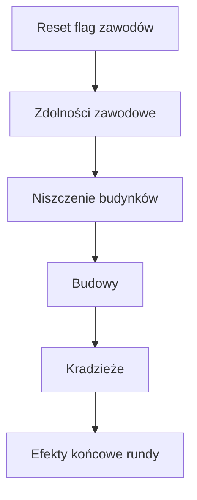

# Rozstrzyganie rundy

Faza **RESOLUTION** stosuje akcje wszystkich graczy według stałej kolejności. Implementacja: `RoundEngine.resolveRound()` w `packages/game-core/src/index.ts`.

## Przepływ

## Krok po kroku

### 1. Reset stanów

Na początku rozstrzygania zerowane są flagi bieżącej rundy:

- `professionAbilityUsed`
- `protected` (Dyplomata)
- `delayedBuildings` (Inspektor)
- `urbanistPendingBuildBoost` (Urbanista)
- `buildingsBuiltThisRound`

**Nie** są resetowane: `deferredBuildActions` (kolejka budów Inspektora).

### 2. Zdolności zawodowe (`applyProfessionAbilities`)

Kolejność rozstrzygania:

1. **Polityk** — ustawia `taxedCategory` przed fazą budowy.
2. **Dyplomata** — `protected = true` (najwyższy priorytet obrony).
3. **Sabotażysta** — blokuje zdolność zawodową celu (`professionAbilityUsed = true`), jeśli cel nie jest chroniony.
4. **Pozostałe** (tylko gdy `!professionAbilityUsed`):
   - **Szczęściarz** — +2 złota
   - **Inspektor** — cel: `delayedBuildings = true` (jeśli cel nie jest chroniony)
   - **Szpieg** — podgląd ręki celu (jeśli cel nie jest chroniony)
   - **Urbanista** — +1 do budynku o najniższej wartości, lub `urbanistPendingBuildBoost` gdy brak budynków

Zdolności pasywne przy budowie (Łowca okazji, Budowlaniec) rozstrzygane są w kroku 5.

### 3. Niszczenie (`resolveDestruction`)

**Wandal** wskazuje gracza i obniża wartość jego **najcenniejszego** budynku o 2 (minimum 0). Nie działa na chronionych ani gdy Sabotażysta zablokował zdolność Wandala (`professionAbilityUsed`).

### 4. Budowy (`resolveBuildings`)

1. Wykonaj `deferredBuildActions` z poprzedniej rundy (Inspektor). Koszt budowy (np. rabat Łowcy okazji) liczy się według `plannedProfession` zapisanej przy odkładaniu.
2. Dla każdego gracza (w kolejności `order`):
   - Jeśli `delayedBuildings` — przenieś akcje `build` do `deferredBuildActions` i pomiń w bieżącej rundzie.
   - Wykonaj akcje `build` (max 1, Budowlaniec: 2).
   - Koszt = wartość karty/budynku; **Łowca okazji** płaci o 2 mniej (min. 0).
   - **Urbanista** — jeśli `urbanistPendingBuildBoost`, pierwszy nowy budynek +1 wartości (max 5).
   - **Polityk** — +1 złoto za każdy budynek **innego** gracza w opodatkowanej kategorii.
   - **Architekt** — po budowie może zmienić kategorię ostatniego budynku.

Budowa jest pomijana, jeśli gracz nie ma wystarczająco złota.

### 5. Kradzieże (`resolveTheft`)

**Złodziej** kradnie od celu **po budowach** — dzięki temu cel najpierw wydaje złoto na wybudowanie budynku:

- **Złoto** — do 2 monet, lub
- **Karta** — losowa karta z ręki celu

Nie działa na chronionych ani gdy Sabotażysta zablokował zdolność Złodzieja (`professionAbilityUsed`).

### 6. Efekty końcowe (`applyEndOfRoundAbilities`)

| Zawód | Efekt |
|-------|-------|
| Księgowy | Jeśli ma mniej niż 2 złota, otrzymuje +2 |

## Priorytety obrony i blokady

1. **Dyplomata** — najwyższy priorytet; blokuje negatywne efekty wobec chronionego gracza.
2. **Sabotażysta** — drugi priorytet; może zablokować zdolność zawodową (np. Inspektora).
3. Pozostałe efekty negatywne (Inspektor, Wandal, Złodziej).

## Zdarzenia losowe

Losowane w fazie **PREP** (przed PLANNING), nie w RESOLUTION. Przy `eventFrequency` losowy gracz może dostać 1–3 złota.

## Powiązane dokumenty

- [Zawody](professions/README.md)
- [Znane problemy](../development/known-issues.md)
